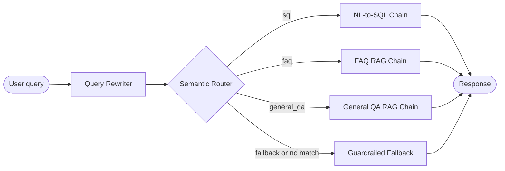
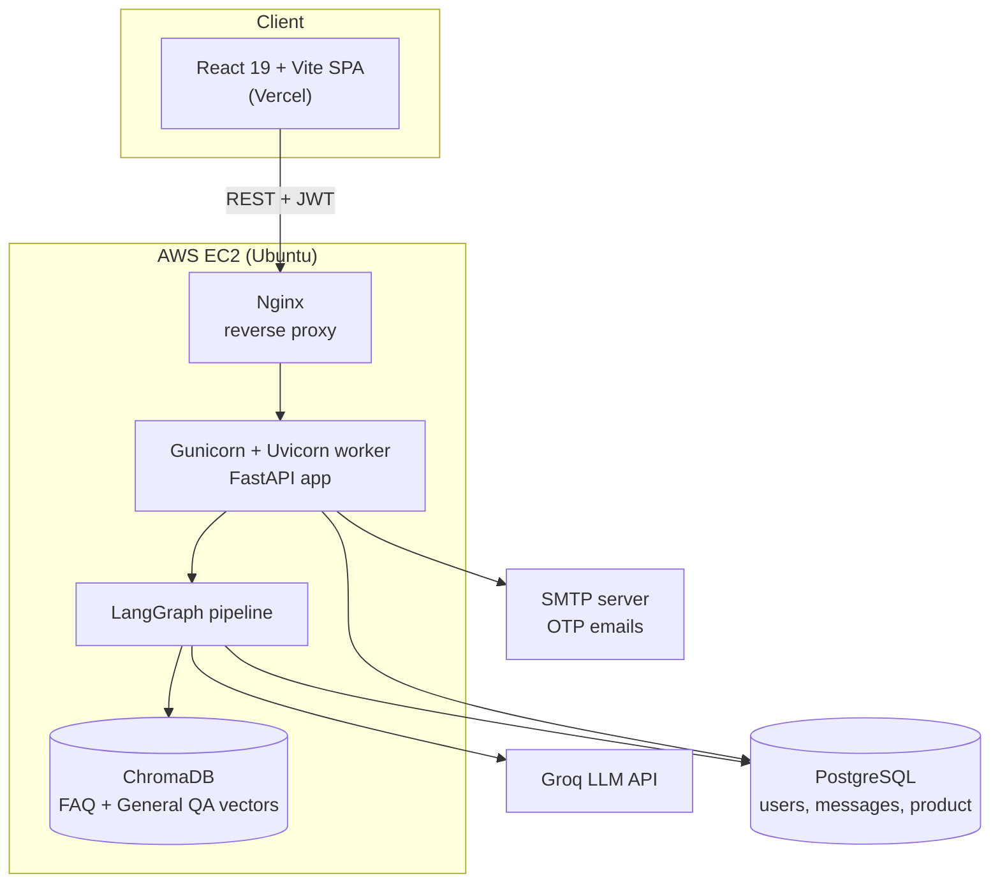
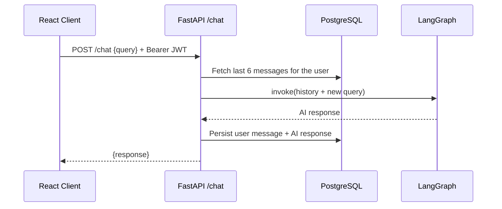

<div align="center">

# 🛒 AI ShopMate — Intelligent E-Commerce Chatbot

**A full-stack conversational shopping assistant that routes every query to the right pipeline — Text-to-SQL for product search, RAG for store policies, and a guardrailed fallback — orchestrated with LangGraph.**


[**🚀 Live Demo**](https://www.aishopmate.online) · [**🏗️ Architecture**](#️-architecture) · [**⭐ STAR Summary**](#-star-summary) · [**⚙️ Getting Started**](#️-getting-started)

</div>

---

## 📑 Table of Contents

1. [Problem & Solution](#-problem--solution)
2. [STAR Summary](#-star-summary)
3. [Key Features](#-key-features)
4. [Architecture](#️-architecture)
5. [How It Works](#-how-it-works)
6. [Tech Stack](#-tech-stack)
7. [Project Structure](#-project-structure)
8. [API Reference](#-api-reference)
9. [Database Schema](#️-database-schema)
10. [Security](#-security)
11. [Testing](#-testing)
12. [Deployment](#️-deployment)
13. [Getting Started](#️-getting-started)
14. [Example Conversations](#-example-conversations)
15. [Design Decisions](#-design-decisions)
16. [Limitations & Roadmap](#-limitations--roadmap)
17. [Author](#-author)

---

## 🎯 Problem & Solution

| ❌ The Problem | ✅ The Solution |
|---|---|
| Shoppers ask very different things in one chat box — product searches, return/refund policies, small talk, and off-topic requests. A single-prompt LLM handles all of them poorly. | A **LangGraph pipeline** first understands the query, then routes it to a purpose-built chain: **Text-to-SQL**, **FAQ RAG**, **General QA RAG**, or a **guardrailed fallback**. |
| LLMs hallucinate prices, availability and policies because they have no access to live catalog data. | Product answers are generated from **real rows in PostgreSQL**; policy answers are **grounded in retrieved context** with an explicit *"I don't know"* path. |
| Short follow-ups such as *"white"* or *"show them"* are meaningless without context. | A **hybrid query rewriter** (rules + LLM) turns follow-ups into complete, self-contained queries using recent conversation history. |
| Chatbots that answer everything drift off-domain and waste tokens. | An **embedding-based semantic router** decides intent without an LLM call, and a **domain-scoped fallback** politely declines out-of-scope requests. |
| Demos often stop at a notebook. | A **production-style stack**: JWT auth, OTP email verification, persistent chat history, automated tests, Nginx + Gunicorn on AWS EC2, and a React frontend on Vercel. |

---

## ⭐ STAR Summary

### 📍 Situation
Online shoppers mix product discovery (*"white cotton girls kurta under ₹2000"*), store-policy questions (*"how long do refunds take?"*), casual chat, and unrelated requests in the same conversation. A one-size-fits-all LLM prompt can't query live catalog data, tends to invent details, spends tokens on trivial messages, and loses the thread on short follow-up messages.

### 🎯 Task
Design and ship an end-to-end AI shopping assistant that could:
1. **Classify intent** reliably and cheaply.
2. Answer product queries from **real catalog data**.
3. Answer policy questions **grounded in a knowledge base**.
4. Keep **multi-turn context** across follow-ups.
5. **Stay in domain** and refuse out-of-scope requests.
6. Provide **secure accounts and persistent chat history**, deployed as a real application.

### ⚡ Action
- Built a **LangGraph `StateGraph`**: `query_rewriter → semantic router → {sql | faq | general_qa | fallback}`.
- Implemented a **hybrid query rewriter**: a deterministic fast path (typo normalisation, greeting short-circuit, policy/unsupported-action detection) plus an LLM rewrite for follow-ups using the last 5 user turns.
- Created an **embedding-based semantic router** (`semantic-router` + MiniLM sentence embeddings) built on **350+ example utterances** across 4 intents — no LLM call needed for routing.
- Engineered a **Text-to-SQL chain** on PostgreSQL: schema-aware prompt, tag-based SQL extraction, SELECT-only execution guard, and a second LLM pass that formats results for the UI.
- Built two **RAG chains on ChromaDB** (FAQ and general Q&A) with top-2 retrieval and context-only answer generation.
- Wrote a **guardrailed fallback** that declines non-shopping requests and is instructed never to fabricate prices, stock or order status.
- Developed a **FastAPI backend** (JWT, bcrypt, OTP-verified registration, OTP password reset, per-user chat history) and a **React 19 + Vite** frontend that parses replies into product cards.
- Added an **automated test suite** (17 tests) and deployed with **Gunicorn/Uvicorn behind Nginx on AWS EC2**, with the frontend on **Vercel**.

### 🏆 Result
- A **deployed, working full-stack GenAI product** — not just a prototype.
- **Four specialised pipelines** behind a single chat box, selected by a router that costs **zero LLM calls**.
- **Grounded answers**: product replies come from live database rows; policy replies come from retrieved context.
- **Context-aware conversations** backed by persistent history (the last 6 messages are fed into every turn).
- A **complete authentication lifecycle** (register → OTP verify → login → reset password → delete account).
- **17 automated tests** covering auth, users and chat endpoints against a real PostgreSQL test database.

---

## ✨ Key Features

**🤖 AI / LLM**
- Multi-intent orchestration with **LangGraph** (rewrite → route → answer)
- **Context-aware follow-ups** (*"Puma shoes under 3000"* → *"blue"* → *"Find blue Puma shoes under 3000"*)
- **Natural-language-to-SQL** product search with brand, price, rating and discount filters
- **RAG** over FAQ and general Q&A knowledge bases (ChromaDB + Sentence-Transformers)
- **Domain guardrails** with a polite redirect for out-of-scope requests

**🔐 Backend & Security**
- **JWT** authentication with **bcrypt** password hashing
- **OTP-verified registration** using a `pending_users` table and hashed OTPs (5-minute expiry, resend supported)
- **OTP-based password reset**
- Per-user **persistent chat history** with view / clear / delete-account operations

**💻 Frontend**
- **React 19 + Vite** SPA with protected routes and session-expiry handling
- **Product cards** rendered by parsing structured LLM output (brand, price, rating, link)
- Welcome screen with suggested prompts, typing indicator, sidebar and confirmation modals
- Responsive layouts (media queries on every page)

**🛠️ Engineering**
- Pydantic-validated settings via environment variables
- Pytest suite with an isolated test DB and a mocked LLM graph
- Nginx reverse proxy + Gunicorn/Uvicorn worker managed by systemd

---

## 🏗️ Architecture

### LangGraph pipeline



### System architecture



### Request lifecycle (`POST /chat`)



---

## 🔍 How It Works

### 1. Query Rewriter — `Orchestration/Orchestration.py`
A hybrid of deterministic rules and an LLM, so simple messages never pay for a rewrite call.

1. **Typo normalisation** for common misspellings (*retrun → return*, *delevary → delivery*, …).
2. **Conversational short-circuit** for greetings, thanks and goodbyes.
3. **Pattern detection** for FAQ questions and unsupported actions (payments, order tracking, cancellation, modification).
4. **First-message pass-through** when there is no history.
5. **LLM rewrite** for follow-ups, using the last 5 user messages (truncated to 200 characters each) under strict rules: a new category replaces the old one, `1k = 1000`, never convert currency, never invent information, and general questions or payment/order actions must **not** inherit product context.

### 2. Semantic Router — `app/router.py`
Uses the `semantic-router` library with a `HuggingFaceEncoder` (`multi-qa-MiniLM-L6-cos-v1`). Each route is defined by a description and example utterances; routing is a vector-similarity match, so it is **fast, deterministic and free of LLM cost**. Unmatched queries default to `fallback`.

| Route | Purpose | Example utterances |
|---|---|---|
| `sql` | Product search, filtering, sorting, comparison, availability | *"find men's Puma shoes under 10000"* |
| `faq` | Returns, refunds, shipping, payments, offers, order management | *"how many days do I have to return"* |
| `general_qa` | Greetings, identity, capabilities, casual chat | *"what can you do"* |
| `fallback` | Anything that does not match confidently | — |

### 3. NL-to-SQL Chain — `app/sql.py`
1. A schema-aware prompt asks the LLM (Groq) for a single `SELECT` wrapped in `<SQL></SQL>` tags, with case-insensitive brand matching via `LOWER(brand) LIKE`.
2. The SQL is extracted with a regex and executed on PostgreSQL only if it is a `SELECT` statement.
3. The top results are passed to a **second LLM call** that formats them as a numbered list (title, price in ₹, discount, rating, link).
4. The React frontend parses that list into **product cards**.

### 4. RAG Chains — `app/faq.py`, `app/general_qa.py`
- CSV knowledge bases are embedded with `all-MiniLM-L6-v2` and stored in **ChromaDB** (ingested lazily on first use).
- The top-2 most similar Q&A pairs become the context.
- The LLM must answer **from context only** and reply *"I don't know"* otherwise.

### 5. Guardrailed Fallback — `app/fall_back.py`
A domain-scoped system prompt restricts the assistant to e-commerce topics and small talk, declines programming, news, medical, legal and other off-topic requests, asks concise clarifying questions for ambiguous shopping queries, and is instructed never to fabricate product, price, order or delivery information.

### 6. Conversation Memory — `backend_routes/routes/chat.py`
On each request the last 6 stored messages for the authenticated user are loaded (newest first, then reversed), converted to LangChain `HumanMessage` / `AIMessage` objects, and passed into the graph. Both the user message and the AI reply are then persisted.

---

## 🧰 Tech Stack

| Layer | Technologies |
|---|---|
| **LLM & Orchestration** | LangGraph, LangChain (`langchain-core`, `langchain-groq`), Groq API |
| **Retrieval & Routing** | ChromaDB, Sentence-Transformers (MiniLM), `semantic-router` |
| **Backend** | Python, FastAPI, Pydantic / pydantic-settings, SQLAlchemy, psycopg2, Uvicorn, Gunicorn |
| **Database** | PostgreSQL |
| **Auth & Security** | python-jose (JWT), passlib + bcrypt, SMTP (OTP email) |
| **Data** | pandas |
| **Frontend** | React 19, Vite, React Router 7, Axios |
| **Testing** | Pytest, FastAPI `TestClient` |
| **Infrastructure** | AWS EC2, Nginx, systemd, Vercel |

---

## 📁 Project Structure

```text
E-commerce-chatbot-2.0/
├── ecommerce_chatbot/
│   ├── Orchestration/
│   │   ├── Orchestration.py        # LangGraph StateGraph: rewriter → router → chains
│   │   └── structured_output.py    # Pydantic intent schema
│   ├── app/
│   │   ├── router.py               # Semantic router (4 routes, 350+ utterances)
│   │   ├── sql.py                  # NL-to-SQL chain (Groq + PostgreSQL)
│   │   ├── faq.py                  # FAQ RAG chain (ChromaDB)
│   │   ├── general_qa.py           # General Q&A RAG chain (ChromaDB)
│   │   └── fall_back.py            # Guardrailed fallback assistant
│   ├── backend_routes/
│   │   ├── main.py                 # FastAPI app, CORS, router registration
│   │   ├── config.py               # Environment-driven settings
│   │   ├── database.py             # SQLAlchemy engine & session
│   │   ├── models.py               # ORM models
│   │   ├── schema.py               # Pydantic request/response schemas
│   │   ├── Oauth2.py               # JWT creation & verification
│   │   ├── utils.py                # Password hashing, OTP email
│   │   └── routes/                 # auth.py · users.py · chat.py
│   └── resources/
│       ├── faq_data.csv            # FAQ knowledge base
│       └── ecommerce_chatbot_qna.csv  # General Q&A knowledge base
├── frontend/                       # React 19 + Vite SPA
│   └── src/
│       ├── pages/                  # Login · Register · VerifyAccount · ForgotPassword · Chat · ChatHistory
│       └── services/api.js         # Axios instance with JWT interceptor
├── tests/                          # Pytest suite (auth, users, chat, root)
├── nginx/ecommerce_chatbot.conf    # Reverse-proxy config
├── gunicorn.service                # systemd unit
├── Procfile                        # Process definition for PaaS platforms
└── requirements.txt
```

---

## 📡 API Reference

Interactive docs are available at `/docs` (Swagger UI) when the backend is running.

| Method | Endpoint | Auth | Description |
|---|---|:---:|---|
| `GET` | `/` | ❌ | Health check |
| `POST` | `/users` | ❌ | Start registration — stores a pending user and emails a 6-digit OTP |
| `POST` | `/users/verify-account` | ❌ | Verify the OTP and create the account |
| `POST` | `/users/resend-otp` | ❌ | Re-send the registration OTP |
| `POST` | `/login` | ❌ | Log in (OAuth2 password form) and receive a JWT |
| `POST` | `/users/forgot-password` | ❌ | Email a password-reset OTP |
| `POST` | `/users/update-password` | ❌ | Reset the password using the OTP |
| `DELETE` | `/delete_user` | ✅ | Delete the current account (cascades to chat messages) |
| `POST` | `/chat` | ✅ | Send a query and receive the chatbot response |
| `GET` | `/chat/history` | ✅ | Get the user's full conversation history |
| `DELETE` | `/chat/delete` | ✅ | Delete the user's conversation history |

<details>
<summary><b>Example: chat request</b></summary>

```bash
curl -X POST http://localhost:8000/chat \
  -H "Authorization: Bearer <ACCESS_TOKEN>" \
  -H "Content-Type: application/json" \
  -d '{"query": "Find Puma shoes under 3000"}'
```

Illustrative response shape:

```json
{
  "response": "1. Puma Men Running Shoes: Rs. 2499 (30 percent off), Rating: 4.3 https://..."
}
```
</details>

---

## 🗄️ Database Schema

| Table | Key columns | Purpose |
|---|---|---|
| `users` | `id`, `email_id` (unique), `password` (bcrypt), `created_at` | Verified accounts |
| `pending_users` | `email_id`, `password` (hashed), `otp_hash`, `expires_at` | Unverified sign-ups awaiting OTP |
| `password_reset_otps` | `email_id`, `otp_hash`, `expires_at`, `is_used` | Password-reset OTPs |
| `messages` | `user_id` (FK → users, `ON DELETE CASCADE`), `role`, `content`, `created_at` | Persistent chat history |
| `product` *(loaded separately)* | `id`, `product_link`, `title`, `brand`, `price`, `discount`, `avg_rating`, `total_ratings` | Catalog queried by the Text-to-SQL chain |

The four application tables are created automatically on startup (`Base.metadata.create_all`). The `product` table is **not** created by the app — see [Getting Started](#️-getting-started).

---

## 🔐 Security

- **Password hashing** with bcrypt (passlib).
- **JWT access tokens** with configurable algorithm and expiry (`python-jose`).
- **OTP hashing** — OTPs are hashed before storage and expire after 5 minutes.
- **Verify-before-create registration** — unverified sign-ups live in `pending_users`, never in `users`; a new sign-up attempt replaces any earlier unverified one.
- **Single-use password-reset OTPs** — the OTP record is removed once the password is updated.
- **Per-user data isolation** — chat history endpoints are scoped to the authenticated user (covered by tests).
- **Secrets via environment variables** — `.env` is git-ignored; settings are validated with `pydantic-settings`.
- **CORS allow-list** for the local dev servers and the production frontend.
- **Read-only SQL execution** — generated SQL is only executed if it is a `SELECT` statement.

---

## 🧪 Testing

The suite lives in `tests/` and contains **17 tests** across authentication, user registration, chat and health endpoints.

- Runs against a **real PostgreSQL test database**, with the schema created and dropped per session and tables cleaned between tests.
- The **LangGraph app is replaced with a lightweight stub**, so tests are deterministic and make no LLM/API calls.
- Covers authentication guards (401s), login success/failure, account deletion, OTP registration replacement, chat persistence, and **per-user history isolation**.

```bash
pytest -v
```

> Test database settings are defined in `tests/conftest.py`. Create a local PostgreSQL database named `E_commerce_test_db` before running, and never point the suite at real data — it drops its tables when the session ends.

---

## ☁️ Deployment

| Component | Platform | Details |
|---|---|---|
| **Frontend** | Vercel | Static Vite build; `vercel.json` rewrites all routes to `index.html` for client-side routing |
| **Backend** | AWS EC2 (Ubuntu) | FastAPI served by **Gunicorn + Uvicorn worker**, managed by **systemd** (`gunicorn.service`) |
| **Reverse proxy** | Nginx | Proxies to `127.0.0.1:8000` with forwarded headers and 120 s timeouts to accommodate LLM latency |
| **Database** | PostgreSQL | Configured through environment variables |

A `Procfile` is included for PaaS-style platforms:

```text
web: gunicorn -k uvicorn.workers.UvicornWorker ecommerce_chatbot.backend_routes.main:fast_app
```

---

## ⚙️ Getting Started

### Prerequisites
- Python 3.11+
- Node.js 20+
- PostgreSQL
- A [Groq API key](https://console.groq.com/)
- An SMTP account for OTP emails (e.g., a Gmail app password)

### 1. Clone the repository
```bash
git clone https://github.com/manojaa2003/E-commerce-chatbot-2.0.git
cd E-commerce-chatbot-2.0
```

### 2. Backend setup
```bash
python -m venv venv
source venv/bin/activate          # Windows: venv\Scripts\activate
pip install -r requirements.txt
```

Create a `.env` file in the project root:

```env
# Database
DATABASE_HOSTNAME=localhost
DATABASE_PORT=5432
DATABASE_NAME=ecommerce_chatbot
DATABASE_USERNAME=postgres
DATABASE_PASSWORD=your_password

# Auth
SECRET_KEY=your_long_random_secret
ALGORITHM=HS256
ACCESS_TOKEN_EXPIRE_MINUTES=60

# LLMs (Groq)
GROQ_API_KEY=your_groq_api_key
GROQ_MODEL=<groq-model-for-sql-and-answers>
GROQ_FAST=<groq-lightweight-model-for-rewrite-faq-fallback>

# SMTP (OTP emails)
SMTP_HOST=smtp.gmail.com
SMTP_PORT=587
SMTP_USER=your_email@example.com
SMTP_PASSWORD=your_app_password
SMTP_FROM=your_email@example.com
```

### 3. Load the product catalog
The Text-to-SQL chain queries a `product` table that you load once:

```sql
CREATE TABLE product (
    id             SERIAL PRIMARY KEY,
    product_link   TEXT,
    title          TEXT,
    brand          TEXT,
    price          INTEGER,           -- in INR
    discount       DOUBLE PRECISION,  -- 0.1 = 10% off
    avg_rating     DOUBLE PRECISION,  -- 0 to 5
    total_ratings  INTEGER
);
```

```sql
\copy product(product_link,title,brand,price,discount,avg_rating,total_ratings) FROM 'products.csv' CSV HEADER
```

### 4. Run the backend
```bash
uvicorn ecommerce_chatbot.backend_routes.main:fast_app --reload --port 8000
```
Application tables are created automatically. On the first run, the sentence-transformer models are downloaded from Hugging Face. API docs: <http://localhost:8000/docs>.

### 5. Run the frontend
```bash
cd frontend
npm install
echo "VITE_API_BASE_URL=http://localhost:8000" > .env
npm run dev
```
Open <http://localhost:5173>.

---

## 💬 Example Conversations

| User says | Rewritten query | Route | What happens |
|---|---|---|---|
| *"Find Puma shoes under 3000"* | *(unchanged)* | `sql` | LLM generates SQL → PostgreSQL → formatted product list rendered as cards |
| *"blue"* *(follow-up)* | *"Find blue Puma shoes under 3000"* | `sql` | Follow-up merged with previous product context |
| *"how long does a refund take?"* | *(unchanged)* | `faq` | Top-2 FAQ entries retrieved from ChromaDB → answer grounded in context |
| *"what payment methods do you accept"* | *(unchanged)* | `faq` | Answered from the FAQ knowledge base |
| *"who are you?"* | *(unchanged)* | `general_qa` | Answered from the general Q&A knowledge base |
| *"write me a Python script"* | *(unchanged)* | `fallback` | Politely declined and redirected to shopping help |

---

## 🧠 Design Decisions

| Decision | Rationale |
|---|---|
| **Semantic router instead of an LLM router** | Routing costs no LLM call: lower latency and cost, deterministic behaviour, and new intents are added by adding example utterances. |
| **Hybrid rewriter (rules + LLM)** | Greetings, policy questions and unsupported actions are handled by rules; the LLM is used only where context resolution is genuinely needed. |
| **Two-stage Text-to-SQL** | Separating *query generation* from *answer formatting* keeps each prompt focused and makes the output predictable enough to parse into UI cards. |
| **Context-only RAG with an "I don't know" path** | Prioritises correctness over fluency, which matters for store policies. |
| **Two Groq models (`GROQ_MODEL` / `GROQ_FAST`)** | A stronger model for SQL and answer synthesis; a lightweight model for rewriting, FAQ answers and fallback. |
| **`pending_users` table** | Unverified email addresses never enter `users`, keeping the account table clean. |
| **Stateless JWT + database-persisted history** | Simple horizontal scaling of the API while retaining per-user conversation memory. |
| **Mocked LangGraph app in tests** | Fast, free and deterministic tests for the API and database layers. |

---

## 🚧 Limitations & Roadmap

**Current limitations**
- The product dataset is not bundled and must be loaded into PostgreSQL.
- Order tracking, payments and order changes are intentionally unsupported; the assistant says so rather than guessing.
- ChromaDB runs in-memory and re-ingests the small CSV knowledge bases on startup.
- Sessions use stateless JWTs; logging out clears the token on the client.

**Roadmap**
- [ ] Harden Text-to-SQL with a read-only database role, SQL parsing/validation and enforced `LIMIT`s
- [ ] Persistent ChromaDB storage (or a managed vector store)
- [ ] Evaluation harness for routing accuracy, SQL correctness and answer groundedness
- [ ] Streaming responses and non-blocking LLM calls
- [ ] Rate limiting, refresh tokens and server-side token revocation
- [ ] Docker Compose setup and CI (GitHub Actions) for tests and linting

---

<!--
## 🖼️ Screenshots
Add screenshots to docs/screenshots/ and uncomment this section.

| Login | Chat & Product Cards | Chat History |
|---|---|---|
|  |  |  |
-->

## 👤 Author

**Manoj**
AI/ML & Generative AI Engineer · Bengaluru, India

[](https://github.com/manojaa2003)
[](https://manojaa2003.github.io/portfolio)
[](https://www.linkedin.com/in/your-linkedin-handle)

Open to **AI/ML Engineer**, **Generative AI Engineer** and **Data Scientist** roles — feel free to reach out!

---

<div align="center">

If you found this project useful, consider giving it a ⭐

Licensed under the [Apache License 2.0](LICENSE)

</div>
